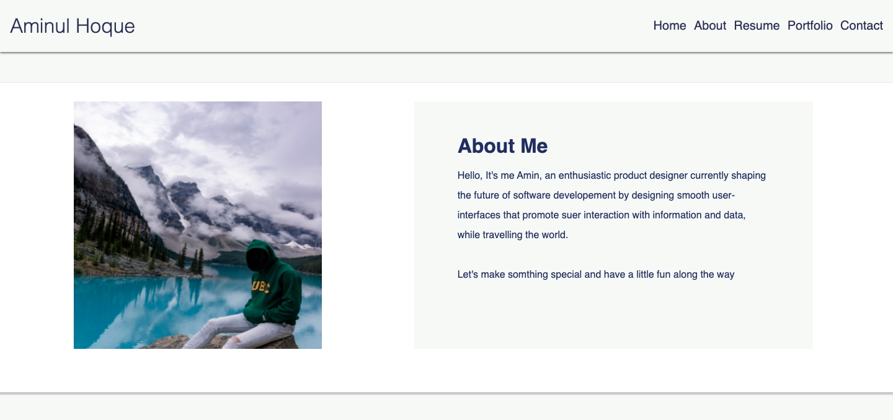

# Portfolio
I've created a portfolio website based on information given to me on week 2nd assignment, i've modified the given wireframe 
(in assignment)..I've tried my best to make it more prettier.

this portfolio is displaying an "About Me", "Experience", "Contact section", with links navigating to each section. 

In addition to displaying and properly linking homeworks with functioning image links. The purpose of the assignment was to ensure that we created a portfolio that reflected the coder as an individual, their past works, some information about them, and how to conatact.

# User Story

AS AN employer. I WANT to view a potential employee's deployed portfolio of work samples. SO THAT I can review samples of their work and assess whether they're a good candidate for an open position

# Acceptance Criteria
GIVEN I need to sample a potential employee's previous work
WHEN I load their portfolio
THEN I am presented with the developer's name, a recent photo, and links to sections about them, their work, and how to contact them
WHEN I click one of the links in the navigation
THEN the UI scrolls to the corresponding section
WHEN I click on the link to the section about their work
THEN the UI scrolls to a section with titled images of the developer's applications
WHEN I am presented with the developer's first application
THEN that application's image should be larger in size than the others
WHEN I click on the images of the applications
THEN I am taken to that deployed application
WHEN I resize the page or view the site on various screens and devices
THEN I am presented with a responsive layout that adapts to my viewport

# Screenshot

# Link
link of the Github directory : https://github.com/ausamindec/week_2.git

# Link of Hosted Website
link : https://ausamindec.github.io/week_2/
